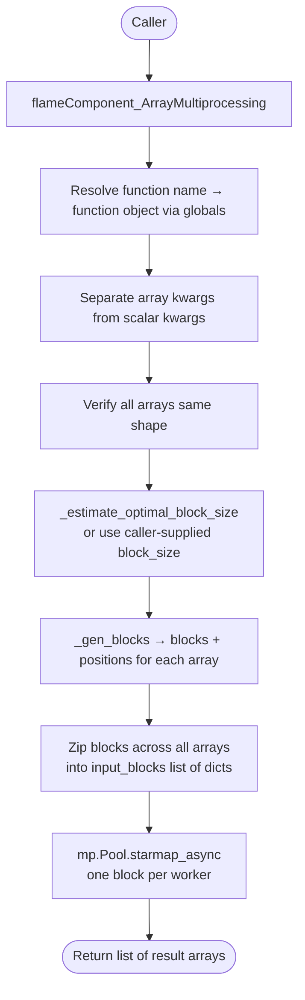
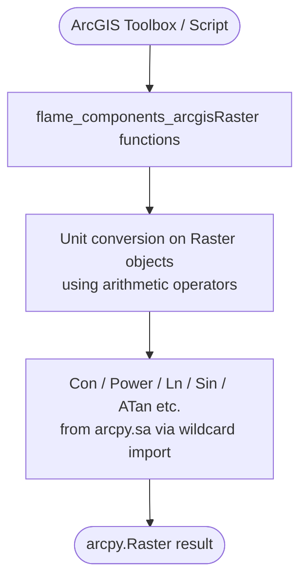

# Flame Components — Codebase Reference

## Architecture Overview

Flame Components is a pure Python library for wildfire flame behavior calculations. It provides
two parallel implementations of the same six scientific functions:

- **`flame_components.py`** — NumPy-based. Accepts scalars, arrays, or masked arrays.
  The authoritative implementation with full input validation and multiprocessing support.
- **`flame_components_arcgisRaster.py`** — ArcPy-based. Thin wrapper that substitutes
  `arcpy.Raster` objects and ArcPy Spatial Analyst operations (`Con`, `Power`, `Ln`, etc.)
  for NumPy equivalents. Intended for use inside ArcGIS toolboxes.

There are no classes, no configuration files, no CLI, and no external state. The library is
imported as a dependency by downstream fire modeling systems.

---

## Key Files and Responsibilities

| File | Lines | Role |
|---|---|---|
| `flame_components.py` | 779 | Core calculations. Full validation, masked-array ops, multiprocessing. |
| `flame_components_arcgisRaster.py` | 307 | ArcGIS variant. Same algorithms, ArcPy ops, minimal validation. |
| `docs/CODEBASE.md` | — | This file. |
| `README.md` | — | Project overview (user-facing). |

### `flame_components.py` — function inventory

| Function | Inputs | Output | Source |
|---|---|---|---|
| `getMidFlameWS` | wind speed, canopy cover, canopy ht, canopy base ht, units | mid-flame wind speed (m/s) | Albini & Baughman (1979) |
| `getFlameLength` | model name, fire intensity, [flame depth], [params_only] | flame length (m) or model coefficients | 29 published models; catalogued from Finney & Grumstrup (2023) |
| `getFlameHeight` | model name, flame length + model-specific params | flame height (m) | Nelson & Adkins (1986) or Finney & Martin (1992) |
| `getFlameTilt` | model name + model-specific params | tilt angle from vertical (degrees) | Standard geometry, Finney & Martin (1992), Butler et al. (2004) |
| `getFlameResidenceTime` | ROS, fuel consumption, mid-flame WS, units | residence time (sec or min) | Nelson & Adkins (1988) |
| `getFlameDepth` | ROS, residence time | flame depth (m) | Fons et al. (1963) |
| `flameComponent_ArrayMultiprocessing` | function name, num_processors, block_size, **kwargs | list of block results | Internal wrapper |
| `_gen_blocks` | array, block_size, stride | (blocks, positions) | Internal helper |
| `_estimate_optimal_block_size` | array_shape, num_processors | block_size int | Internal helper |

### `flame_components_arcgisRaster.py` — additions

| Function | Role |
|---|---|
| `getDegrees(in_data)` | Radian → degree conversion for Raster or float |
| `getRadians(in_data)` | Degree → radian conversion for Raster or float |

Same six core functions are present with identical signatures except parameters typed as
`arcpy.Raster` instead of `ndarray`.

---

## Data Flow

### Single-function call (NumPy path)

```mermaid
flowchart TD
    A([Caller: scalar or ndarray]) --> B{Any ndarray in inputs?}
    B -- yes --> C[return_array = True]
    B -- no --> D[return_array = False]
    C & D --> E[Validate each param\nTypeError / ValueError if bad]
    E --> F[Wrap scalars → ma.array\nWrap arrays → ma.array with NaN mask]
    F --> G[Unit conversion\ne.g. km/h → m/s, m → ft]
    G --> H[Derive intermediates\ne.g. crown_ratio, f, slope_rad]
    H --> I{Model selection\ndict lookup or if/elif}
    I --> J[Vectorised calculation\nma.where / power / sin / log ...]
    J --> K[Clamp negatives to 0]
    K --> L{return_array?}
    L -- yes --> M([Return ndarray via .data])
    L -- no --> N([Return scalar via .data[0]])
```

### Multiprocessing path



### ArcGIS path



---

## Implicit Assumptions and Gotchas

### Unit handling
- `getMidFlameWS` **always returns m/s** regardless of input units. All internal geometry
  is done in feet (Albini & Baughman equation is defined in US customary); SI inputs are
  converted to feet, then result is m/s.
- `getFlameResidenceTime` input `ros` must be **m/min**, but the internal calculation
  divides by 60 to convert to m/s for the Nelson & Adkins equation. The `units` param only
  controls whether the *output* is seconds or minutes — it does not change expected input units.
- Wind speed reference height differs between functions:
  - `getMidFlameWS` expects **10-m wind** (SI) or **20-ft wind** (IMP).
  - `getFlameTilt` Butler model expects **10-m wind** measured above open ground or canopy top.
  These are different measurement conventions; mixing them will silently produce wrong results.

### Model-specific required params are checked at call time, not statically
`getFlameHeight` and `getFlameTilt` use `Optional` params that become required depending on
`model`. Missing required params raise `ValueError`, but IDEs cannot catch this at write time.

### `getFlameHeight` Nelson model: `fire_type` validation has a bug
At `flame_components.py:305`, the scalar-wrapping branch checks `isinstance(midflame_ws,
numbers.Real)` instead of `isinstance(fire_type, numbers.Real)`. A scalar `fire_type` will
not be wrapped into a masked array via this branch and may cause downstream errors.

### ArcGIS variant has weaker validation
`flame_components_arcgisRaster.py` does almost no input validation — it relies on ArcPy
raising its own errors. The `getFlameTilt` Finney model uses a scalar equality check
(`if flame_height == flame_length`) that will not work correctly when `flame_height` is a
`Raster` object; this branch will always fall through to the `else` path.

### `flameComponent_ArrayMultiprocessing` is unverified
Marked with `# TODO - Verify that this function works...` (line 675). The function name
map references `'flame_residence': 'getFlameResidence'` but the actual function is named
`getFlameResidenceTime` — this key will silently resolve to `None` and raise `ValueError`
at runtime.

### `canopy_ht == 0` guard
`getMidFlameWS` replaces zero canopy heights with `0.5 * 3.28084` ft (≈ 0.5 m) to avoid
division-by-zero in the log term. This is a silent substitution; callers with legitimately
open (no canopy) sites should be aware their canopy height inputs are altered.

### NaN propagation is implicit
NaNs in input arrays become masked values. Masked positions propagate silently through all
`ma` operations and appear as NaN in the output `.data` array. There is no warning or count
of how many cells were masked.

### `return_array` detection is input-type-based, not output-type-based
If all inputs are scalars, the function returns a Python float even though internally
everything is computed as a 1-element masked array. Callers must be consistent — mixing
scalar and array inputs from different sources will flip the return type.

### `getFlameLength` `params_only=True`
Returns raw tuple of model coefficients rather than a computed value. Useful for
introspection but the return type changes (`tuple` vs `float`/`ndarray`) — callers must
guard against this.
