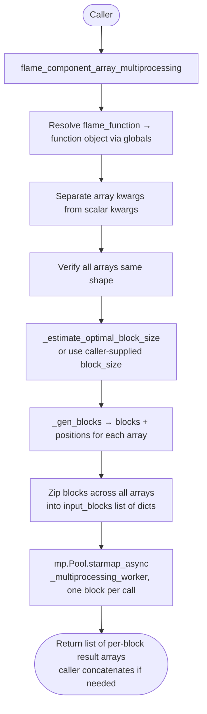

# Flame Components — Codebase Reference

## Architecture Overview

Flame Components is a pure-Python, `src/`-layout library for wildfire flame-behavior
calculations. All public functions accept scalars, `numpy.ndarray`, or NaN-containing
arrays and share a common validation/masking/return-type contract (see below).

- **`src/flame_components/core.py`** — the entire implementation: 6 scientific functions,
  1 multiprocessing dispatcher, and 3 private helpers. NumPy-based (`numpy.ma`), full
  input validation.
- **`src/flame_components/__init__.py`** — thin re-export shim. Imports the 7 public
  names from `core.py`, sets `__all__`, and exposes `__version__` via
  `importlib.metadata` (hatch-vcs-derived at build time).

There are no classes, no configuration files, no CLI, and no external state. The library
is imported as a dependency by downstream fire-modeling systems (e.g. FuelAnalyst).

An ArcPy-based variant (`archive/flame_components_arcgisRaster.py`) exists in the repo but
is **not part of the installable package** — `pyproject.toml` excludes `archive/` from the
sdist, and nothing in `src/` imports it. It predates the current API (camelCase names,
`arcpy.Raster` inputs) and is kept only as a historical reference for anyone porting the
Raster-based calculations forward; treat anything in it as unmaintained.

---

## Key Files and Responsibilities

| File | Role |
|---|---|
| `src/flame_components/core.py` | All 7 public functions + private multiprocessing helpers. |
| `src/flame_components/__init__.py` | Public API re-export, `__all__`, `__version__`. |
| `docs/CODEBASE.md` | This file — internal architecture reference. |
| `docs/TEST_SUITE_DESCRIPTION.md` | Current test-suite catalog and conventions. |
| `README.md` | User-facing project overview, install, usage, API reference. |
| `tests/unit/`, `tests/integration/`, `tests/regression/` | 114 tests total — see `docs/TEST_SUITE_DESCRIPTION.md`. |
| `archive/flame_components_arcgisRaster.py` | Unmaintained ArcPy variant. Excluded from the sdist. Not imported by anything in `src/`. |

### `core.py` — function inventory

| Function | Inputs | Output | Source |
|---|---|---|---|
| `get_mid_flame_ws` | wind speed, canopy cover, canopy ht, canopy base ht, units | mid-flame wind speed (m/s) | Albini & Baughman (1979) |
| `get_flame_length` | model name, fire intensity, [flame depth], [params_only] | flame length (m) or model coefficients | 29 published models; catalogued from Finney & Grumstrup (2023) |
| `get_flame_height` | model name, flame length + model-specific params | flame height (m) | Nelson & Adkins (1986) or Finney & Martin (1992) |
| `get_flame_tilt` | model name + model-specific params | tilt angle from vertical (degrees) | Standard geometry, Finney & Martin (1992), Butler et al. (2004) |
| `get_flame_residence_time` | ROS, fuel consumption, mid-flame WS, units | residence time (sec or min) | Nelson & Adkins (1988) |
| `get_flame_depth` | ROS, residence time | flame depth (m) | Fons et al. (1963) |
| `flame_component_array_multiprocessing` | flame_function name, num_processors, block_size, **kwargs | list of per-block result arrays (not concatenated) | Internal dispatcher over the above |
| `_multiprocessing_worker` | func_name, kwargs_dict | function result | Internal — module-level so `multiprocessing.Pool` can pickle it |
| `_gen_blocks` | array, block_size, stride | (blocks, positions) | Internal helper |
| `_estimate_optimal_block_size` | array_shape, num_processors | block_size int | Internal helper |

No camelCase aliases exist — see the 2026-08-24 Decision Log entry (removed entirely,
pre-first-release, no deprecation cycle needed since there were no external consumers yet).

---

## Data Flow

### Single-function call

```mermaid
flowchart TD
    A([Caller: scalar or ndarray]) --> B{Any ndarray in inputs?}
    B -- yes --> C[return_array = True]
    B -- no --> D[return_array = False]
    C & D --> E[Validate each param\nTypeError / ValueError if bad]
    E --> F[Wrap scalars → ma.array\nWrap arrays → ma.array with NaN mask]
    F --> G[Unit conversion\ne.g. km/h → m/s, m → ft]
    G --> H[Derive intermediates\ne.g. crown_ratio, f, slope_rad]
    H --> I{Model selection\ndict lookup or if/elif}
    I --> J[Vectorised calculation\nma.where / power / sin / log ...]
    J --> K[Clamp negatives to 0]
    K --> L{return_array?}
    L -- yes --> M([Return ndarray via .filled(nan)])
    L -- no --> N([Return scalar via .filled(nan)[0]])
```

### Multiprocessing path



---

## Implicit Assumptions and Gotchas

These are real behaviors of the current code, not historical bugs — several are also
asserted directly by the test suite (see `docs/TEST_SUITE_DESCRIPTION.md`).

### Unit handling
- `get_mid_flame_ws` **always returns m/s** regardless of input units. All internal
  geometry is done in feet (the Albini & Baughman equation is defined in US customary
  units); SI inputs are converted to feet, then the result is converted to m/s.
- `get_flame_residence_time`'s `ros` input must always be **m/min**; the `units` param
  only controls whether the *output* is seconds or minutes — it does not change the
  expected input unit.
- Wind-speed reference height differs between functions and is **not interchangeable**:
  - `get_mid_flame_ws` expects **10-m wind** (SI) or **20-ft wind** (IMP).
  - `get_flame_tilt`'s Butler model expects **10-m wind** measured above open ground or
    canopy top, using its own unit-conversion path (`kph`/`mps`/`mph`).
  Passing the output of one into the other's wind-speed input will silently produce a
  wrong result — there is no cross-check between them.

### Model-specific required params are checked at call time, not statically
`get_flame_height` and `get_flame_tilt` accept `Optional` params that become required
depending on `model`; missing required params raise `ValueError`, but a type checker or
IDE cannot catch this at write time since the signature alone allows `None`.

### `flame_component_array_multiprocessing` returns a list, not a concatenated array
The dispatcher returns one result array per block, in block order — callers must call
`numpy.concatenate(results)` themselves to get a single array. This is documented in the
function's docstring and covered by `test_kwargs_signature_accepts_keyword_arguments` and
the alias-equivalence tests that were removed with the aliases (the concatenation
behavior itself is still exercised in `tests/regression/test_gotchas.py`).

### `canopy_ht == 0` guard in `get_mid_flame_ws`
Zero canopy heights are replaced with `0.5 * 3.28084` ft (≈0.5 m) to avoid
division-by-zero in the log term, and a `UserWarning` is raised. This is a silent
substitution — callers with legitimately open (no-canopy) sites should be aware their
`canopy_ht` input is altered before the calculation runs.

### NaN propagation is explicit via `.filled(nan)`, never `.data`
NaNs in input arrays become masked values via `numpy.ma`. `numpy.ma`'s "domained" ufuncs
(`ma.divide`, `ma.power`, `ma.log`, ...) substitute an internal safe/poison value into
masked positions *before* computing, so `.data` at a masked index can hold garbage — every
function in `core.py` returns `.filled(nan)` / `.filled(nan)[0]` specifically to guarantee
a literal NaN at masked positions, never a leftover internal fill value. See the 2026-07-01
Decision Log entry for the numeric proof (`ma.power(masked, 2).data` → `1e20`).

### `return_array` detection is input-type-based, not output-type-based
If all inputs are scalars, the function returns a Python `float` even though internally
everything is computed as a 1-element masked array. Callers must be consistent — mixing
scalar and array inputs from different sources will flip the return type based on whether
*any* input happened to be an `ndarray`.

### `get_flame_length`'s `params_only=True`
Returns the raw tuple of model coefficients rather than a computed value. Useful for
introspection but the return type changes (`tuple` vs. `float`/`ndarray`) — callers must
guard against this rather than assuming a numeric return.

### Two deliberately different failure modes for bad input
- **Type/argument errors** (wrong type, missing required argument, unknown `model`/`units`
  string) raise `TypeError`/`ValueError` immediately.
- **Numerically degenerate but validly-typed input** (division by zero, an `arccos`
  argument outside `[-1, 1]`) returns `NaN`, consistent with the NaN-propagation contract
  above — this is intentional, not a gap. See `docs/TEST_SUITE_DESCRIPTION.md`'s
  "Documented NaN-for-undefined behaviors" for the exact list.
